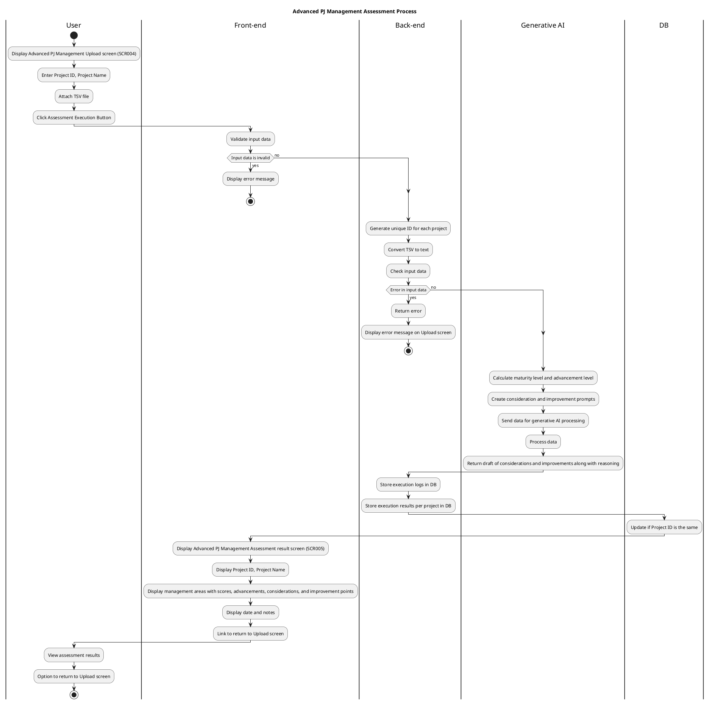

```plantuml
@startuml
title Advanced PJ Management Assessment Process

|User|
start
:Display Advanced PJ Management Upload screen (SCR004);
:Enter Project ID, Project Name;
:Attach TSV file;
:Click Assessment Execution Button;

|Front-end|
:Validate input data;
if (Input data is invalid) then (yes)
  :Display error message;
  stop
else (no)
endif

|Back-end|
:Generate unique ID for each project;
:Convert TSV to text;
:Check input data;
if (Error in input data) then (yes)
  :Return error;
  :Display error message on Upload screen;
  stop
else (no)
endif

|Generative AI|
:Calculate maturity level and advancement level;
:Create consideration and improvement prompts;
:Send data for generative AI processing;
|Generative AI|
:Process data;
:Return draft of considerations and improvements along with reasoning;

|Back-end|
:Store execution logs in DB;
:Store execution results per project in DB;
|DB|
:Update if Project ID is the same;

|Front-end|
:Display Advanced PJ Management Assessment result screen (SCR005);
:Display Project ID, Project Name;
:Display management areas with scores, advancements, considerations, and improvement points;
:Display date and notes;
:Link to return to Upload screen;

|User|
:View assessment results;
:Option to return to Upload screen;
stop

@enduml
```
